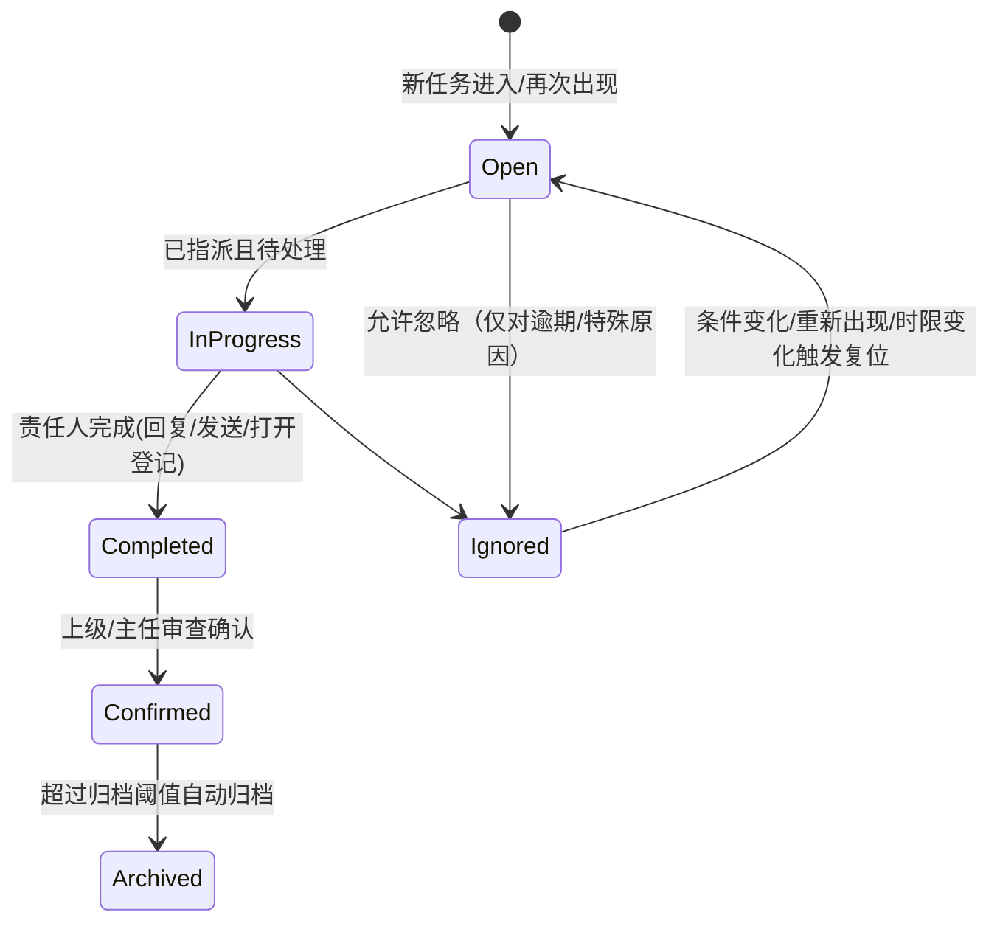

# CIMS 接口/文函提醒客户端（DB 直连升级版）需求规格说明书（SRS）

> 文档类型：需求说明 / 需求规格（可直接用于开发对接）  
> 目标读者：业务负责人、CIMS 运维/DBA、客户端研发、测试、信息安全  
> 版本：v0.1（用于“从离线 Excel 驱动 → CIMS 数据库直连”升级立项与开发对接）

---

## 0. 摘要

公司“接口管理”工作包含两类业务对象：

- **接口文件**：需要在规定时间内 **打开**、并在后续 **回复**（接口有唯一编号）。
- **文函**：需要在规定时间内 **回复** 或 **发送**（文函有唯一编号）。

目前上述动作必须在公司网页系统 **CIMS** 上完成，但 CIMS **无法及时提醒**每位员工，导致逾期风险与管理成本。现计划开发一个**每名员工安装的桌面客户端**，直连 CIMS 后台数据库（只读为主，逐步扩展写回），按规则抓取员工负责的接口/文函任务，并提供提醒、分派、状态追踪与导出。

---

## 1. 背景与现状（As-Is）

### 1.1 现状流程（简化）

1. 员工在 CIMS 上查看自己负责的接口/文函列表
2. 根据时间要求完成“打开/回复/发送”等操作
3. 上级/主任在 CIMS 或线下跟踪完成情况

### 1.2 现状痛点

- CIMS 网页端**缺乏强提醒机制**（新任务/临期/逾期无法可靠触达个人）
- 任务量大时，个人容易漏看；主任难以掌握真实进度与风险
- 现有“离线版本”依赖从 CIMS **导出的 Excel**，存在：
  - 数据不是实时，导出动作依赖人工
  - 多人同时导出/处理存在版本差异
  - 无法做到连续、稳定的通知与追踪闭环

### 1.3 既有离线程序资产（可复用）

当前离线程序已实现的能力（需要在升级版中继承/复用）：

- 多类型任务识别与筛选、按项目号分组、多线程处理、结果导出
- 角色权限体系（所领导/室主任/接口工程师/设计人员/管理员）
- 任务状态追踪（Registry：open/completed/confirmed/archived）、忽略延期、历史查询
- 写入任务队列化（避免锁冲突）、系统托盘、开机自启、自动更新、数据库状态显示等

> 注：上述能力来自现有“接口筛选程序”文档与模块说明，可作为升级版的“基线能力清单”。  

---

## 2. 建设目标（To-Be）

### 2.1 总目标

构建一个**桌面客户端**，使每位员工无需频繁打开 CIMS 网页，也能：

- **及时收到**：新任务、临期任务、逾期任务提醒
- **准确看到**：仅与本人/本室/全所权限匹配的任务集合
- **快速处理**：一键跳转到 CIMS 对应页面进行“打开/回复/发送”
- **可追踪审计**：状态、分派、回文单号/回复信息等有迹可循
- **可导出**：按项目/科室/类型输出日报、周报、逾期清单

### 2.2 分阶段策略（建议）

- **阶段 A（MVP / 只读闭环）**：DB 直连抓取 + 本地规则筛选 + 提醒 + 一键打开 CIMS 页面  
  *不直接修改 CIMS 数据，只做提醒与辅助操作。*
- **阶段 B（半闭环 / 写回增强）**：在权限允许前提下，支持写回少量字段（如“责任人指派”“回文单号/回复编号”或“确认标记”）  
  *写回需 DBA/信息安全明确授权，必要时通过 CIMS 提供 API 或存储过程实现。*

> 本需求文档覆盖 A + B 的全量需求；实施可按阶段逐步启用。

---

## 3. 术语与对象定义

| 术语 | 定义 |
|---|---|
| CIMS | 公司网页系统，接口/文函业务的权威来源与操作入口 |
| 接口文件（Interface） | 具有唯一“接口编号”，存在“需打开/需回复”等动作与时限 |
| 文函（Letter/Doc） | 具有唯一“文函编号”，存在“需回复/需发送”等动作与时限 |
| 任务（Task） | 从接口/文函抽象出的待办条目：包含责任人、时限、状态、跳转链接等 |
| 责任人 | 任务实际执行人（个人） |
| 主办室/科室 | 任务归属组织维度（结构一室/二室/总图等），用于主任视图 |
| 回文单号/回复编号 | 证明“已回复/已发送”的编号（可能写回/可能只记录本地） |
| 版次 | 同一接口/文函可能有版本（A/B/C…），展示与追踪以“最高版次”为准 |

---

## 4. 业务规则与状态机

### 4.1 任务生命周期（逻辑状态）

### 4.2 关键规则（继承与复位）

- 同一业务对象（同一编号 + 同一项目/组织归属）在多次同步中出现时，应尽量**继承**历史状态、指派信息
- 若关键字段变化（如“要求完成时间/版次/责任人字段被清空”等），需按规则**复位**到 Open/待处理状态，并保留必要审计信息

> 备注：具体“唯一键”和“复位字段”依赖 CIMS 数据库的数据字典（见第 8 章）。

---

## 5. 用户角色与权限模型

### 5.1 角色定义

| 角色 | 可见范围 | 核心操作 |
|---|---|---|
| 设计人员 | 仅看“责任人=本人”的任务 | 查看、提醒、跳转 CIMS、填写回文信息（若启用写回） |
| 接口工程师 | 本室全部任务 | 额外：批量分派、查看室内汇总 |
| 室主任 | 本室全部任务（含时间窗口） | 额外：确认/取消确认、忽略逾期、导出室级报表 |
| 所领导 | 全所任务（通常时间窗口更短） | 额外：跨室汇总、重点督办、忽略逾期 |
| 管理员 | 全量数据（无窗口限制） | 全部功能、系统配置、维护模式 |

### 5.2 权限来源与身份映射

客户端启动后需确定“当前用户是谁”，并映射到：

- **姓名（中文）**
- **角色**
- **组织归属（室/科室代码）**

**建议的身份源优先级：**

1. Windows 登录账号 → CIMS 用户表/人员表映射
2. 若无法映射，则手动选择一次（写入本地 config），后续自动使用

---

## 6. 功能需求（Functional Requirements）

> 编号格式：FR-xx。验收应按编号逐条验证。

### 6.1 客户端安装与运行

- **FR-01**：提供 Windows 桌面客户端安装包（建议仍可打包为单 EXE + _internal 目录）
- **FR-02**：支持最小化到系统托盘、开机自启动（可配置）
- **FR-03**：支持自动更新（从内网共享目录/发布目录拉取），更新过程对用户透明且可恢复

### 6.2 CIMS 数据库连接与配置

- **FR-10**：客户端支持配置 CIMS 数据库连接信息（服务器、实例、库名、认证方式、超时）
- **FR-11**：支持两种认证方式（按信息安全策略选择其一或两者）：
  - Windows 集成认证（优先）
  - SQL 账号认证（受控发放）
- **FR-12**：默认只读连接；写回能力必须显式启用并通过权限校验（见 FR-70）
- **FR-13**：提供“连接状态”实时显示（已连接/同步中/失败/等待等），并可查看错误详情

### 6.3 数据同步与增量策略

- **FR-20**：支持手动同步（按钮）与自动同步（定时，默认 5~10 分钟可配）
- **FR-21**：同步应尽量采用“增量”：
  - 基于更新时间戳（updated_at）
  - 或基于业务表的流水/日志表
  - 若无增量字段，则采用“范围查询 + 本地去重/继承”
- **FR-22**：同步结果应落地本地缓存（建议 SQLite），并可用于离线查看最近一次结果
- **FR-23**：同步失败时不影响 UI 使用（展示上次成功数据 + 明确告警）

### 6.4 任务抽取与分类

- **FR-30**：从 CIMS DB 中抽取接口/文函记录，并映射为统一 Task 模型（见第 8 章）
- **FR-31**：至少支持以下任务类型（可与现有离线分类保持一致）：
  - 内部需打开接口
  - 内部需回复接口
  - 外部需打开接口
  - 外部需回复接口
  - 三维提资接口
  - 收发文函（需回复/超期未回复等）
- **FR-32**：支持按项目号自动分组，并在 UI 中按“项目 → 类型”聚合展示

### 6.5 任务筛选规则（业务规则引擎）

- **FR-40**：任务筛选应支持“组织/科室”“时限窗口”“完成标记”“作废/排除”等规则  
- **FR-41**：规则应可配置/可热更新（至少支持通过 JSON 配置文件调整关键字段与阈值）
- **FR-42**：同一业务对象多版本存在时，仅展示最高版次（或按配置选择“全部/最高”）

> 说明：现离线程序存在多步筛选与版次处理逻辑，升级版需在 DB 字段层面重建同等效果。

### 6.6 任务提醒与通知

- **FR-50**：客户端应提供至少三类提醒：
  - 新任务出现（自上次同步以来新增）
  - 临期提醒（如 ≤3 个工作日 / ≤7 个工作日，阈值可配）
  - 逾期提醒（已超过要求完成时间）
- **FR-51**：提醒方式至少包括：
  - Windows 通知（Toast）
  - 托盘图标徽标/闪烁
  - 客户端内“待办计数”与高亮
- **FR-52**：提醒需支持“静默时段/免打扰”（午休/夜间可配）
- **FR-53**：提醒去重：同一任务在未变化情况下不重复弹出；若状态/时限变化则重新提醒

### 6.7 快速跳转与处理闭环（只读阶段）

- **FR-60**：每条任务应提供“一键打开 CIMS 对应页面”的跳转入口  
  - 优先：直接 URL（含参数）
  - 备选：跳转到列表页 + 自动填充搜索条件（如编号）
- **FR-61**：支持复制编号、复制项目号、复制责任人等快捷操作（右键菜单）

### 6.8 写回能力（阶段 B，可选启用）

- **FR-70**：在 DB 权限与信息安全批准后，可启用写回：
  - 写回责任人（指派）
  - 写回回文单号/回复编号
  - 写回“已处理/已回复”标记（如 CIMS 有对应字段）
- **FR-71**：写回必须满足：
  - 权限校验（仅允许特定角色/特定字段）
  - 审计日志（谁在何时改了什么）
  - 失败可重试、避免并发写冲突
- **FR-72**：写回建议通过：
  - CIMS 提供 API（优先）
  - 或 DBA 提供存储过程（次优）
  - 直接 UPDATE 基表（仅在强管控下允许）

### 6.9 分派、确认、忽略、历史

- **FR-80**：支持批量分派：上级为任务选择责任人，并形成记录（含“指派记忆”）
- **FR-81**：支持上级确认/取消确认（用于审查闭环）
- **FR-82**：支持忽略逾期任务（需填写原因），并在条件变化时自动解除忽略
- **FR-83**：支持按“项目号+编号”查询历史版本与状态变更记录

### 6.10 报表与导出

- **FR-90**：支持导出 Excel（保持列结构可配置）与 TXT/Markdown 汇总
- **FR-91**：汇总至少包含：
  - 涉及项目号清单
  - 各项目分类型数量
  - 按科室分组的临期/逾期标签

---

## 7. 数据需求与接口（Data Requirements）

> 本章是“升级成 DB 直连”最关键的对接点：需要 CIMS DBA 提供数据字典/表结构/字段含义。

### 7.1 统一 Task 数据模型（逻辑）

| 字段 | 说明 | 示例 |
|---|---|---|
| task_id | 本地唯一 ID（可由 business_id + 版本/行号哈希生成） | SHA1(...) |
| business_id | 业务唯一键（编号级） | 内部回复|项目号|接口编号 |
| source_type | 来源类别（接口/文函） | interface / letter |
| task_type | 任务类型（见 FR-31） | 外部需回复接口 |
| project_id | 项目号 | 1907 |
| doc_id | 接口编号/文函编号 | ICM-xxx |
| version | 版次 | A/B/C |
| org_unit | 主办室/科室代码 | 25C1 |
| org_name | 科室名称 | 结构一室 |
| responsible_person | 责任人（可能多人） | 张三 |
| due_date | 要求完成日期 | 2026-02-15 |
| status | 本地状态（open/completed/confirmed/archived/ignored） | open |
| completed_info | 回文单号/回复编号（若有） | HW-2026-001 |
| cims_url | 直达链接（若可构造） | https://... |
| updated_at | CIMS 最近更新时间（用于增量） | 2026-02-10 09:01 |

### 7.2 数据源要求（对 DBA 的交付物）

- **DR-01**：提供接口管理相关的**核心表**或**只读视图**（推荐）  
- **DR-02**：提供文函收发相关的**核心表**或**只读视图**（推荐）
- **DR-03**：明确每个字段的：
  - 数据类型、是否可空、业务含义
  - 编号生成规则、项目号规则
  - 状态字段含义（已回复/未回复/作废等）
  - 版次字段规则（A/B/C…还是数字版本）
  - 更新时间字段（updated_at/modified_time）
- **DR-04**：给出“如何构造跳转 URL”的规则或接口（若 CIMS 支持）

### 7.3 本地状态库（Registry）建议

建议沿用现有 Registry 思路，在客户端维护**本地状态库**，用于：

- 首次出现/最后出现时间
- 状态流转（完成/确认/忽略/归档）
- 指派记忆
- 审计日志

---

## 8. 非功能性需求（NFR）

### 8.1 性能与容量

- **NFR-01**：单次同步在常规网络条件下 ≤ 3 秒（仅增量）；全量 ≤ 15 秒（可接受）
- **NFR-02**：UI 打开后首屏渲染 ≤ 1 秒（使用本地缓存）
- **NFR-03**：支持全所并发使用（例如 50~200 客户端同时在线）不对 CIMS DB 造成明显压力（需 DBA 配合索引/视图）

### 8.2 可靠性与可用性

- **NFR-10**：网络/DB 短时不可用时，客户端可继续查看上次数据并提示错误
- **NFR-11**：崩溃不丢数据：本地状态库与队列具备自动恢复能力

### 8.3 安全与合规

- **NFR-20**：最小权限原则：默认只读；写回需最小字段集 + 白名单角色
- **NFR-21**：连接信息与本地缓存需加固（至少避免明文泄露；按公司安全要求选型）
- **NFR-22**：日志脱敏：不在日志中输出敏感账号/凭据
- **NFR-23**：支持维护模式：管理员可通知客户端停止写入/停止同步以便 DB 维护

### 8.4 兼容性与运维

- **NFR-30**：兼容 Win7/Win10/Win11（若公司仍有 Win7，需维持对应 Python/依赖策略）
- **NFR-31**：内网无互联网环境可部署：更新、依赖、文档均可离线分发
- **NFR-32**：提供可观测性：同步耗时、失败次数、最近成功时间、客户端版本分布（可选）

---

## 9. 交付物与验收

### 9.1 交付物清单

- 可执行客户端（EXE）及运行依赖
- 安装/更新/回滚说明（运维手册）
- 连接配置模板（含最小权限说明）
- 数据字典映射文档（字段映射表）
- 测试用例与验收报告模板

### 9.2 验收标准（样例）

- 连接成功：在配置正确时可稳定同步并展示任务
- 任务准确率：与 CIMS 网页端人工抽查一致率 ≥ 99%
- 提醒可达：新任务/临期/逾期在同步后 1 分钟内触发提醒（按去重规则）
- 权限正确：不同角色登录看到的数据范围与预期一致
- 稳定性：连续运行 5 个工作日无重大崩溃；同步失败可自动恢复

---

## 10. 依赖、风险与开放问题（必须在立项前澄清）

### 10.1 关键依赖

- CIMS 数据库：表结构、字段、权限、索引、视图/存储过程支持
- 人员与组织映射：Windows 账号 ↔ CIMS 用户 ↔ 中文姓名 ↔ 科室角色
- CIMS 跳转规则：能否构造直达 URL（或提供内部 API）

### 10.2 主要风险

- DB 压力：大量客户端频繁全量查询导致压力上升（需增量与索引）
- 写回安全：若直接写基表，存在审计与误操作风险（需 API/存储过程）
- 数据一致性：CIMS 中“状态字段”含义不清/存在多来源，导致规则误判

### 10.3 开放问题（建议立项即明确）

1. CIMS 是否存在“任务更新时间 updated_at”？若无，如何做增量？
2. 接口/文函的“完成标记”字段分别是什么？是否统一？
3. “版次”字段是否存在？如何判断“最高版次”？
4. 跳转 URL 是否可稳定构造？是否需要单点登录/二次认证？
5. 阶段 B 写回允许哪些字段？由谁审批？是否必须走存储过程？

---

## 11. 附：需求到实现的模块拆分建议（研发用）

- data_source/
  - cims_sqlserver_connector.py（DB 连接、查询、增量）
  - mapping.py（字段映射与字典）
- domain/
  - task_model.py（统一 Task）
  - rules_engine.py（筛选/版次/继承/复位规则）
- state/
  - registry.sqlite（本地状态库：任务、事件、忽略、审计）
- ui/
  - task_board（列表与过滤）
  - notifier（提醒中心）
- ops/
  - updater（自动更新）
  - diagnostics（日志、健康检查）

---

## 12. 参考（现有离线程序资产）

- 《接口筛选程序 - 程序框架》（2026.02.06.1）
- 《接口筛选程序 - 模块功能说明》（2026.02.06.1）
- 《接口筛选程序 - 技术专题》（2026.02.06.1）
