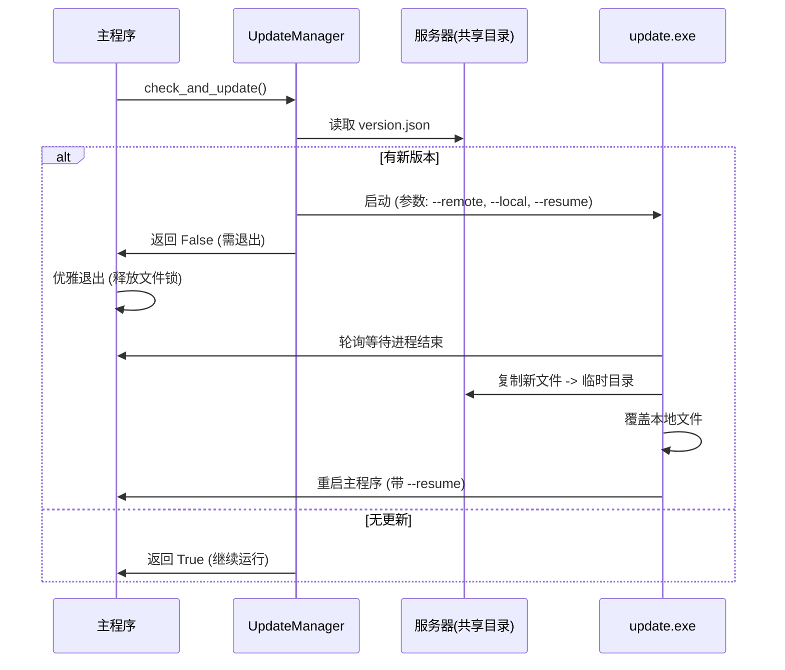

# 通用自动更新模块架构与复用指南

## 1. 概述

本文档详细描述了本项目采用的“双进程热更新”架构。该模块设计为通用组件，可轻松复用于其他基于 Python (Tkinter/PyInstaller) 开发的桌面应用程序。

**核心目标**：解决 Windows 下 exe 文件运行时无法被覆盖的问题，实现全自动、无感知的版本升级。

## 2. 核心架构

系统由三个核心组件构成：

1.  **主程序 (Main App)**
    *   集成 `UpdateManager`。
    *   负责启动时的版本检查。
    *   负责在检测到更新时优雅退出（释放文件锁）。
    *   负责重启后的状态恢复（Resume Action）。

2.  **更新管理器 (UpdateManager)**
    *   代码位置：`update/manager.py`
    *   负责逻辑判断：读取本地/远程 `version.json`，比较版本号。
    *   负责启动独立更新器：使用 `subprocess.Popen` 启动 `update.exe` 并传递参数。

3.  **独立更新器 (Updater)**
    *   代码位置：`update/updater_cli.py` (打包为 `update.exe`)
    *   **独立进程**：与主程序完全解耦。
    *   **守护逻辑**：等待主程序完全退出（解除文件占用）。
    *   **原子更新**：先将文件下载到临时目录，校验无误后再覆盖安装目录。
    *   **自动重启**：更新完成后拉起主程序，并传递恢复参数。

## 3. 目录结构规范

为了实现通用复用，建议遵循以下目录结构：

### 3.1 本地开发环境
```text
ProjectRoot/
├── main.py                 # 主程序入口
├── base.py                 # 包含更新集成的基类
├── version.json            # 版本描述文件
├── excel_processor.spec    # PyInstaller打包配置
└── update/                 # [核心复用模块]
    ├── __init__.py
    ├── manager.py          # 更新管理器逻辑
    ├── updater_cli.py      # 独立更新器脚本
    └── versioning.py       # 版本处理工具
```

### 3.2 部署环境 (服务器端)
```text
ServerRoot/ (例如: D:\Programs\接口筛选\测试文件)
└── EXE/                    # 必须命名为 EXE
    ├── version.json        # 最新版本号
    ├── 主程序.exe
    ├── update.exe          # 必须包含
    └── _internal/          # PyInstaller 依赖文件夹
```

### 3.3 客户端运行环境
```text
ClientRoot/
├── version.json            # 当前版本
├── 主程序.exe
├── update.exe              # 用于执行更新
└── _internal/              # 依赖库
```

## 4. 关键组件详解

### 4.1 版本文件 (`version.json`)
统一使用 JSON 格式，便于扩展：
```json
{
  "version": "2025.11.23.2",
  "release_date": "2025-11-23",
  "description": "修复了已知bug"
}
```

### 4.2 更新流程图


## 5. 复用接入指南

若要在新项目中使用此模块，请按以下步骤操作：

### 第一步：复制模块
将 `update/` 文件夹完整复制到新项目根目录。

### 第二步：配置主程序
在主程序的入口类（如 `base.py` 或 `main.py`）中集成：

```python
# 1. 导入管理器
from update.manager import UpdateManager

# 2. 初始化 (建议在 __init__)
self.update_manager = UpdateManager(
    app_root=self.app_root,
    main_executable="你的程序名.exe",  # 关键：指定主程序名
    log_fn=self.log_function          # 可选：接入日志系统
)

# 3. 执行检查 (在关键操作前)
def ensure_up_to_date(self):
    # 获取远程路径 (可从配置读取)
    remote_path = self.config.get("remote_path") 
    
    should_continue = self.update_manager.check_and_update(
        folder_path=remote_path,
        reason="start_work",
        resume_action="start_work",   # 重启后自动恢复的动作
        auto_mode=True
    )
    
    if not should_continue:
        self.quit_application()       # 必须执行退出！
    return should_continue

# 4. 实现优雅退出
def quit_application(self):
    # 销毁窗口，确保进程完全结束
    self.root.destroy()
    import os
    os._exit(0)  # 强制退出，避免线程卡死
```

### 第三步：处理重启恢复
在主程序启动参数解析中处理 `--resume`：

```python
# main.py
import argparse

parser = argparse.ArgumentParser()
parser.add_argument("--resume", help="更新后恢复的动作")
args = parser.parse_args()

app = MyApp()
if args.resume == "start_work":
    # 自动开始之前的任务
    app.root.after(1000, app.start_processing)
```

### 第四步：打包配置 (`.spec`)
**这是最关键的一步**。必须将 `update` 模块打包为独立的 `update.exe`，并确保依赖完整。

```python
# your_app.spec

# 1. 主程序分析
a = Analysis(['main.py'], ...)

# 2. 更新程序分析 (新增)
update_analysis = Analysis(
    ['update/updater_cli.py'],  # 指定入口
    pathex=[],
    binaries=[],
    datas=[],
    hiddenimports=[],
    hookspath=[],
    hooksconfig={},
    runtime_hooks=[],
    excludes=[],
    noarchive=False,
)

# 3. 主程序 EXE
exe = EXE(a, name='主程序', ...)

# 4. 更新程序 EXE (新增)
update_exe = EXE(
    update_analysis,
    pyz,
    update_analysis.scripts,
    [],
    exclude_binaries=True,
    name='update',  # 必须叫 update
    debug=False,
    bootloader_ignore_signals=False,
    strip=False,
    upx=True,
    console=True,   # 建议开启控制台以便调试，稳定后可关闭
)

# 5. 收集文件 (COLLECT)
coll = COLLECT(
    exe,
    a.binaries,
    a.datas,
    # 包含 update.exe
    update_exe,
    update_analysis.binaries,
    update_analysis.zipfiles,
    update_analysis.datas,
    # 包含版本文件
    [('version.json', 'version.json', 'DATA')],
    ...
)
```

## 6. 技术细节与注意事项

1.  **文件锁处理**：
    *   Windows 下无法覆盖正在运行的 EXE。
    *   `updater_cli.py` 实现了 `wait_for_main_exit`，会循环检测主程序进程是否消失，且尝试以写模式打开文件（原子锁检测）。
    
2.  **PyInstaller 兼容性**：
    *   支持 PyInstaller 6.x 的 `_internal` 目录结构。
    *   支持 PyInstaller 5.x 及以下的单目录结构。
    *   代码中自动通过 `sys._MEIPASS` 和 `_internal` 路径探测版本文件。

3.  **安全性**：
    *   使用了 `tempfile` 创建临时目录下载文件，下载完整后再进行覆盖，防止网络中断导致程序损坏。
    *   保留了关键的运行时库（如 `python3.dll`），若被占用则跳过，通常不影响小版本更新。

4.  **调试建议**：
    *   `update.exe` 运行时会在同目录下生成 `update_log.txt`，这是排查更新失败（如权限不足、路径错误）的首要依据。

## 7. 总结

本模块实现了一套高可用、低耦合的自动更新机制。通过将更新逻辑剥离为独立进程，完美解决了 Windows 文件占用问题，并支持断点续传（逻辑上支持，目前实现为原子覆盖）和状态恢复。

